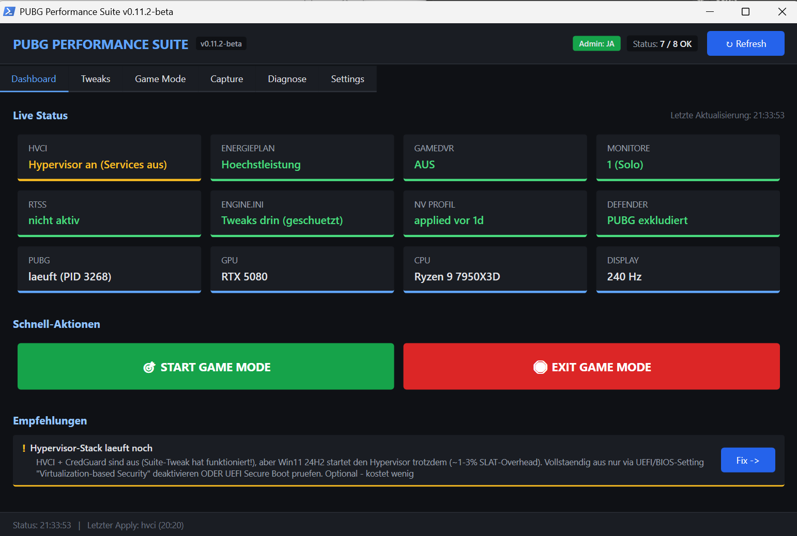
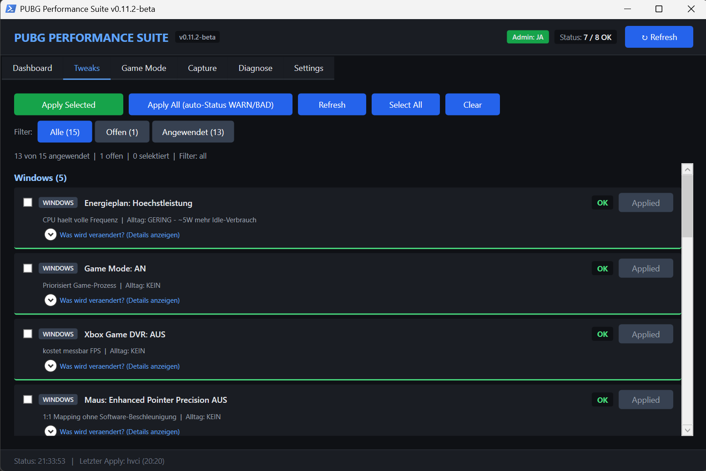
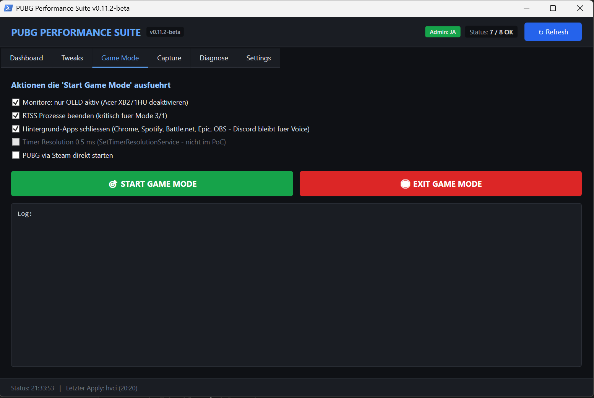
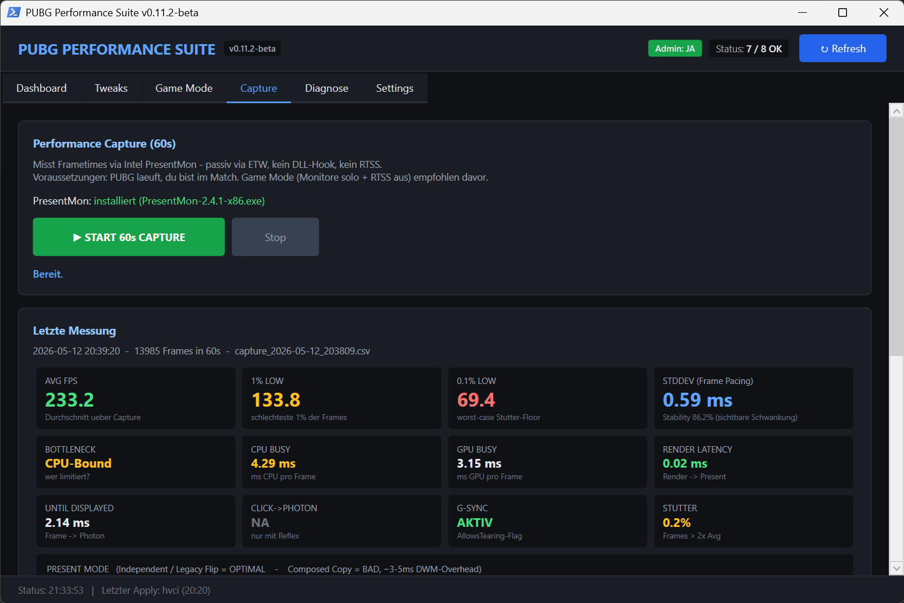
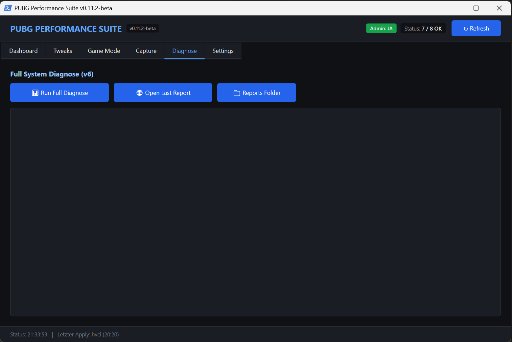
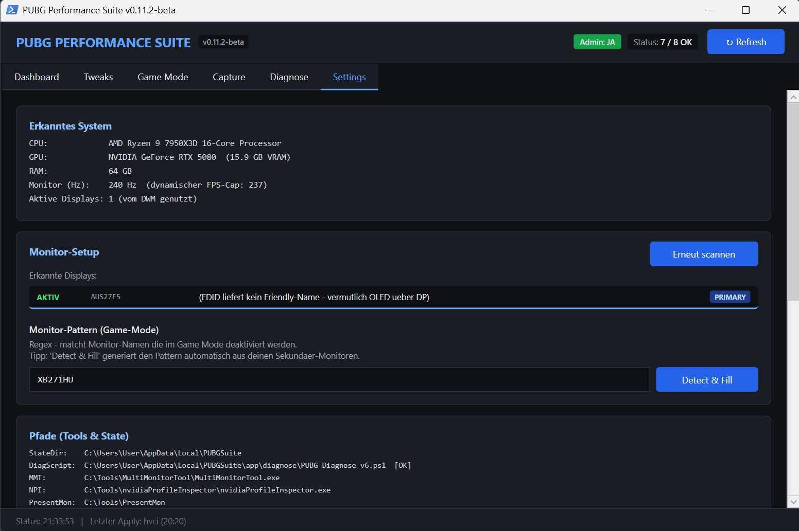

# PUBG Performance Suite

> Windows-native PowerShell-WPF Tool zum Diagnostizieren und Tunen von PUBG fuer Competitive-Play. BattlEye-safe, vollstaendig reversibel, keine externen Dependencies ausser auto-installierten Open-Source-Helpern.


## Warum diesem Tool vertrauen?

Drei Dinge sollten dir klar sein **bevor** du etwas applist:

1. **Open Source**. Jede Zeile ist lesbar in `PUBG-Suite.ps1`. Jeder Tweak listet die exakten Registry-Keys / File-Pfade die geaendert werden (Klick auf "Was wird veraendert? (Details anzeigen)" pro Tweak).
2. **Vollstaendig reversibel**. Vor jedem Apply wird ein Snapshot der alten Werte in `history.json` gespeichert. 14 von 15 Tweaks haben einen 1-Klick-Revert-Button. File-Tweaks (Engine.ini, GameUserSettings.ini) werden vorher in `%LOCALAPPDATA%\PUBGSuite\backups\` als `.bak_<timestamp>` gesichert.
3. **BattlEye-safe by design**. Bewusst ausgeschlossen (siehe [Safety](#safety)): Special K, ReShade, DXVK, ban-bait Engine.ini CVars, Process-Lasso auf BEService.exe. Jeder Tweak veraendert entweder Windows-OS-Settings, User-AppData oder User-controllable PUBG-Settings - **keiner haengt sich an den TslGame.exe-Prozess**.

**Was die Suite NICHT tut:** Keine Telemetrie, keine Cloud-Calls, keine "Phone home"-Logik. Internet-Traffic nur:
- One-time NPI-Download von `github.com/Orbmu2k/nvidiaProfileInspector` (nur wenn NV-Profile-Tweak applied wird)
- One-time MMT-Download von `nirsoft.net` (nur wenn Game Mode benutzt wird)
- One-time PresentMon-Download von `github.com/GameTechDev/PresentMon` (nur wenn Capture-Tab benutzt wird)
- ICMP-Pings (`1.1.1.1`, `8.8.8.8`, `steamcommunity.com`) waehrend Diagnose

## Was es macht

Modernes PUBG laeuft auf den meisten Setups in die **gleichen Probleme**: VBS/HVCI-Overhead, falscher Present Mode (RTSS + Multi-Monitor), fehlende Engine.ini-Tweaks, NVIDIA-Default-Profile, DPI/Game-Bar Misconfigurations.

Diese Suite **erkennt alle live**, laesst dich **per Tweak einzeln applien** mit **Revert-Button pro Tweak**, und bietet einen **1-Klick Game Mode** der Sekundaer-Monitore deaktiviert + Overlay-Prozesse killt vor dem PUBG-Start.

## Screenshots

### Dashboard - Live Status + Quick Actions + Empfehlungen


### Tweaks Tab - 16 Tweaks mit Apply/Revert, Filter, Per-Tweak Details


### Game Mode - Pre-Game Prep (Monitore, RTSS, Background-Apps)


### Capture Tab - 60s PresentMon-Capture mit 14 KPIs + Trend-Tabelle


### Diagnose - Full System Diagnose (v6) mit HTML-Report


### Settings - Auto-Detected Hardware + Pfade + Logs/Backups


## Features

### 16 Tweaks - alle einzeln applybar + revertierbar

**Windows (5)**
- Energieplan: Hoechstleistung
- Game Mode: AN
- Xbox Game DVR: AUS
- Maus: Enhanced Pointer Precision AUS
- Maus: Slider auf 6/11 (1:1 DPI-Mapping)

**PUBG (5)**
- Vollbildoptimierungen (FSO) AUS fuer TslGame.exe - ermoeglicht Hardware Independent Flip statt Composed Copy
- Engine.ini Tweaks: Sharpening 0.7, Streaming PoolSize 4096, Frame-Pacing CVars, `r.D3D11.UseAllowTearing=1`. Datei wird nach Apply Read-Only damit PUBG sie nicht beim Spielstart ueberschreibt
- Esport-Grafik (Competitive-Profil): schreibt das In-Game-Grafikmenue in `GameUserSettings.ini` - Exklusiv-Vollbild, Sicht-Blocker (Schatten/Post/Effekte/Laub) niedrig, Spotting-Klarheit (AA/Texturen) mittel-hoch, V-Sync + Motion Blur aus. Aufloesung bleibt unangetastet, alle Werte menue-konform (BattlEye-safe)
- PUBG FPS-Cap = Monitor-Hz minus 3 (dynamisch berechnet aus Primary-Display)
- NVIDIA PUBG-Profil via NPI (Low Latency, Power Max, Threaded Optimization etc.) - NPI wird auto-installiert wenn fehlt

**System / Admin (6)**
- Defender Exclusion fuer PUBG-Pfad
- Virtualization Security (VBS + HVCI): AUS - inkl. Credential Guard und `bcdedit /set hypervisorlaunchtype off` (kritisch fuer Win11 24H2)
- Hardware-accelerated GPU Scheduling (HAGS): AN - **Optional**, nicht in "Apply All"
- MMCSS Gaming-Profil (SystemResponsiveness 10, NetworkThrottlingIndex off)
- Game-unfriendly Services disabled (SysMain, WSearch, DiagTrack, MapsBroker)
- NIC Offloads (RSS, Checksum-Offload, LSO)

### Live Dashboard - 12-Card 4x3 Grid

Status-Cards: HVCI/VBS, Energieplan, GameDVR, Monitore, RTSS, Engine.ini, NV-Profil, Defender, PUBG-Process. Plus Hardware-Info-Cards: GPU, CPU, Display-Hz.

Plus: Recommendation-Engine mit klickbaren "Fix ->"-Buttons die direkt in den jeweiligen Tab springen.

### Game Mode - 1-Klick Pre-Game-Prep

- Sekundaer-Monitore deaktivieren via MultiMonitorTool (auto-installiert)
- RTSS / RivaTuner beenden (forciert PresentMode 5 → 1)
- Background-Apps killen (Chrome, Spotify, Battle.net, Epic, OBS - **Discord bleibt fuer Voice**)
- Optional: PUBG direkt via Steam-URI starten

### Performance Capture - 60s PresentMon mit 14 KPIs

Passive ETW-basierte Capture (kein DLL-Hook, kein Overlay) zeigt:
- **FPS-Metriken**: AVG, 1% Low, 0.1% Low
- **Frame Pacing**: StdDev (ms) + Stability-Score (%)
- **Bottleneck-Analyse**: CPU-Bound / GPU-Bound / Balanced (aus MsCPUBusy vs MsGPUBusy)
- **Latency**: Render→Present, Frame→Photon, Click→Photon (Reflex-only)
- **G-Sync Status** (AllowsTearing-Flag)
- **Stutter %** (Frames > 2x Average)
- **Present Mode** mit OPTIMAL/OK/WARN/BAD Klassifizierung in Farbe
- **Trend-Tabelle**: letzte 8 Captures mit Delta vs Baseline
- "Was bedeuten diese Metriken?"-Expander mit Klartext-Erklaerung

### Auto-Detection

- Primary Monitor Refresh-Rate → dynamischer FPS-Cap (Hz - 3)
- PUBG Steam-Install-Pfad via Library-Manifest
- Dedicated GPU (filtert iGPU automatisch)
- "Detect & Fill" generiert Monitor-Regex automatisch

### Diagnose

Startet die volle v6-Diagnose-Engine im Non-Interactive-Mode, generiert HTML-Report mit 6 Sections (GPU, CPU, NICs, PUBG-Files, Network, Recommendations).

## Safety

**Bewusst ausgeschlossen** zur Vermeidung von BattlEye-Bait:
- ❌ Special K (DLL-Injection)
- ❌ ReShade
- ❌ DXVK / Vulkan-Layer
- ❌ Engine.ini `r.Fog=0`, `r.Atmosphere=0`, Sub-UI Shadow-Values
- ❌ Negative `r.MipMapLODBias`
- ❌ Process-Lasso CPU-Affinity auf `BEService.exe`
- ❌ UuuClient / Universal UE Unlocker (alle "Engine-Unlock"-Tools sind detected)
- ❌ WPR/WPA ETW-Trace waehrend PUBG laeuft (BattlEye-Historie mit ETW-False-Positives)

Jeder Tweak in der Suite veraendert entweder User-controllable UI-Settings, Files in User-AppData oder OS-System-Settings die nicht am Game-Prozess haengen.

## Requirements

- Windows 10 (1909+) oder Windows 11
- PowerShell 5.1 (auf modernem Windows builtin)
- Administrator-Rechte (fuer HKLM-Tweaks; Non-Admin reicht fuer HKCU + PUBG-Tweaks)
- Optional: NVIDIA GPU fuer NPI-Profile-Features

## Installation

### One-Line Install (empfohlen)

In einer **Administrator-PowerShell**:

```powershell
irm "https://raw.githubusercontent.com/Sotrax/pubg-performance-suite/main/launch.ps1" | iex
```

Das laedt herunter, installiert nach `%LOCALAPPDATA%\PUBGSuite\app\`, legt einen Desktop-Shortcut an und startet die Suite. Der gleiche Befehl jederzeit erneut ausgefuehrt = Update auf neueste Version.

### Manual Install

1. Latest [Release-ZIP](https://github.com/Sotrax/pubg-performance-suite/releases) downloaden oder Repo klonen
2. In einen Ordner deiner Wahl entpacken
3. Rechtsklick `PUBG-Suite.bat` → **Als Administrator ausfuehren**

## Quick Start

1. **Launch via Desktop-Shortcut** (oder `PUBG-Suite.bat` - die `.ps1` direkt elevated sich nicht)
2. **Dashboard-Tab** - sieh deinen aktuellen Stand im Status-Grid
3. **Tweaks-Tab** - waehle was du applien willst
   - Filter "Offen" zeigt nur die Tweaks die noch nicht OK sind
   - `Apply` pro Zeile, `Apply Selected` mit Checkboxes, oder `Apply All` (mit Bestaetigung)
4. **Game Mode-Tab** - vor jedem PUBG-Match:
   - `START GAME MODE` → Monitore switchen, RTSS stirbt, Background-Apps schliessen
   - Spielen
   - `EXIT GAME MODE` → alles wird zurueckgesetzt
5. **Capture-Tab** - waehrend PUBG laeuft im Match:
   - `START 60s CAPTURE` → 10s Pre-Countdown, dann 60s PresentMon-Capture
   - Ergebnis: 14 KPIs + Trend gegen letzte Messungen
6. **Settings-Tab** - Monitor-Pattern anpassen, Logs/Backups oeffnen, erkannte Hardware sehen

## Wie Revert funktioniert

Jeder Apply captured einen **Pre-Change-Snapshot** (Registry-Werte mit Type, File-Copies, Service-States) in `history.json`. Der Apply-Button transformiert nach Erfolg in einen orangenen **Revert**-Button. Klick darauf restored den Pre-Apply-State.

Revert ist unterstuetzt fuer **14 von 15 Tweaks** (NVIDIA-Profile nutzt NPIs eigene Reset-Funktion - derzeit kein automatisierter Revert in der Suite).

## Architektur

```
pubg-performance-suite/
├── PUBG-Suite.ps1            # Haupt-GUI (WPF, ~3700 Zeilen)
├── PUBG-Suite.bat            # Self-elevating Launcher
├── launch.ps1                # GitHub Bootstrap (irm | iex Target)
├── diagnose/
│   └── PUBG-Diagnose-v6.ps1  # Voller Diagnose-Backend, generiert HTML-Report
├── helpers/                  # Optionale standalone Helpers
│   ├── Nur-OLED.ps1
│   ├── Alle-Monitore.ps1
│   └── PUBG-Capture.bat
└── docs/
    ├── screenshots/          # PNG-Screenshots fuer README
    ├── TWEAKS.md             # Volle Referenz aller Tweaks
    ├── INSTALL.md            # Detaillierter Install/Uninstall
    └── TROUBLESHOOTING.md
```

## State Storage

Alle User-Daten bleiben lokal in `%LOCALAPPDATA%\PUBGSuite\`:
- `config.json` - User-Praeferenzen (Monitor-Pattern etc.)
- `history.json` - Apply/Revert-History mit Snapshots
- `logs\YYYY-MM-DD.log` - taeglicher Action-Log
- `backups\` - Pre-Change File-Copies
- `captures\` - PresentMon CSV-Outputs + `captures.json` Trend-Daten

## Contributing

PRs willkommen. Bereiche wo Hilfe besonders geschaetzt waere:
- **Testing auf AMD-GPU / Intel-CPU / Win10-Systemen** - aktuell nur validiert auf Win11 25H2 + RTX 5080 + Ryzen 7950X3D
- **Zusaetzliche Tweaks** (Audio-Enhancements, Steam-Launch-Options etc.) - bitte mit Evidence/Source!
- **Englische Lokalisierung** (UI-Strings aktuell nur Deutsch)
- **Bug-Reports** mit Log aus `%LOCALAPPDATA%\PUBGSuite\logs\`

## License

MIT - siehe [LICENSE](LICENSE)

## Acknowledgments

- [Orbmu2k/nvidiaProfileInspector](https://github.com/Orbmu2k/nvidiaProfileInspector) - NPI fuer NVIDIA-Driver-Profile-Manipulation
- [NirSoft MultiMonitorTool](https://www.nirsoft.net/utils/multi_monitor_tool.html) - Monitor-Enable/Disable via CLI
- [Intel GameTechDev/PresentMon](https://github.com/GameTechDev/PresentMon) - ETW-basierte Frame-Capture
- [CapFrameX](https://github.com/CXWorld/CapFrameX) - Referenz fuer Frame-Pacing-Metriken (Stutter Index, GPU Busy Deviation)
- [valleyofdoom/TimerResolution](https://github.com/valleyofdoom/TimerResolution) - referenced fuer Timer-Resolution Advice
- Community-Wissen von r/PUBATTLEGROUNDS, BlurBusters Forum, Igor's Lab, Tom's Hardware und Competitive-Guides

---

**Status**: Beta `0.12.0` - feature-complete fuer Single-User-Workflow, validiert auf Win11 25H2 + RTX 5080 + Ryzen 7950X3D. Braucht Cross-Setup-Testing auf AMD-GPU / Intel-CPU / Win10-Systemen vor 1.0.
